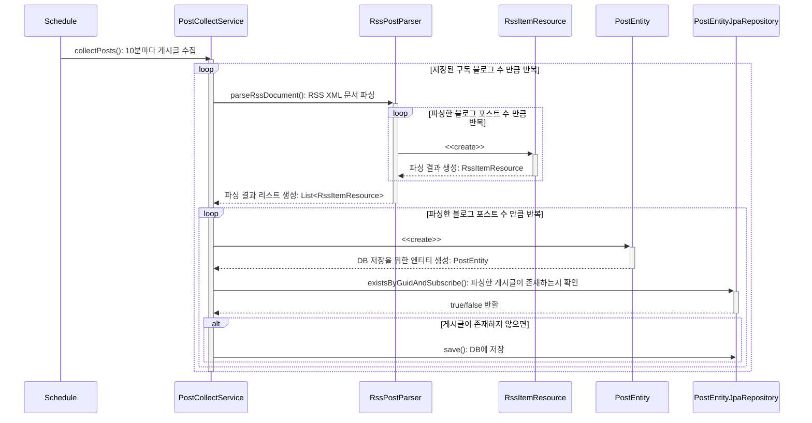
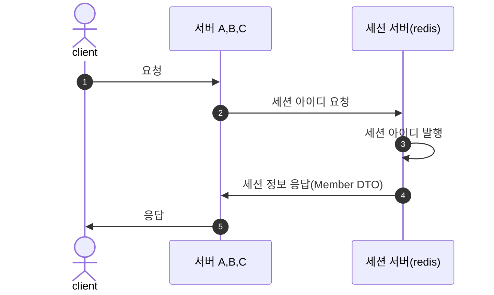

# RSS-Reader
파리지옥 템플릿에 사용될 Rss Reader를 만드는 저장소입니다.

---
## 프로젝트 소개
- 배포 URL :
- 진행기간 : 2023. 11 ~ 진행 중
- [Postman Publish Link](https://documenter.getpostman.com/view/31047574/2s9YsDmb8v)
- [팀 블로그](https://flytrap-dev.tistory.com/)

> RSS-Reader는 사용자가 여러 블로그 플랫폼을 구독하여 원하는 Feed를 볼 수 있고 서로 반응을 나눌 수 있는 플랫폼 서비스입니다.
실제로 굉장히 잘 구축되어있는 웹서비스 feedly 를 레퍼런스로 우리가 직접 쓰기 위한 작은 서비스를 구현하고 싶어 여러 기능을 구현 했습니다.
[프로젝트 소개 글](https://flytrap-dev.tistory.com/5)

### 사용법
# 스크린 샷
## 게시글 보기


## 폴더 추가


## RSS 문서 및 멤버 추가


## 로그인, 로그아웃


---

## 기술스택, 및 개발환경

   


- [디자인](https://flytrap.notion.site/69f7ecb5dfc5490cbc2389d4b4bd49c7?pvs=4)
- [컨벤션](https://flytrap.notion.site/BE-0c6637bdeaa1408b9998467e525033fb?pvs=4)
- [브랜치 전략, 및 PR 템플릿](https://flytrap.notion.site/GitHub-b3f73e8928ef4b4d931c6f7fc692b0ed?pvs=4)

---

## 프로젝트 주요 기능
- 깃허브 **로그인**을 통해 로그인할 수 있습니다.
- 회원은 **폴더** 만들고, 삭제, 수정, 조회할 수 있습니다.
- 회원은 폴더에 블로그를 **구독** 할 수 있습니다.
  - 개인 폴더, **공유 폴더** 두 가지가 있습니다.
- 사용자는 북마크를 추가, 삭제, 수정, 조회할 수 있습니다.
- 사용자는 공유 폴더 안에 있는 포스트만 **리액션**을 추가, 삭제할 수 있습니다.
- 사용자가 구독한 폴더에 새 글이 올라오면 **알림**을 받을 수 있습니다.
- Rss-Reader는 Scheduler을 통한 구독을 기준으로 포스트 크롤링 작업을 합니다.
---

## 인프라 구조


---

## 프로젝트 설치 및 실행 방법
**요구사항**
애플리케이션을 구축하고 실행하려면 다음이 필요합니다.
- Java 17
- Spring Boot 3.0.0 이상

설치
```
$ git clone https://github.com/FlytrapHub/RSS-Reader.git
$ cd rss-reader
```

---

## 프로젝트 구조

### ERD 다이어 그램


---
### 주요 서비스 시퀀스 다이어 그램

- Post 수집 서비스 시퀀스 다이어그램


- Login 서비스 시퀀스 다이어그램

---


## 팀원 소개
<table>
 <tr>
    <td align="center"><a href="https://github.com/jinny-l"></td>
    <td align="center"><a href="https://github.com/new-pow"></td>
    <td align="center"><a href="https://github.com/crtEvent"></td>
    <td align="center"><a href="https://github.com/leegyeongwhan"></td>
    <td align="center"><a href="https://github.com/jaea-kim"></td>
  </tr>
  <tr>
    <td align="center"><a href="https://github.com/jinny-l"><b>jinny-l</b></td>
    <td align="center"><a href="https://github.com/new-pow"><b>new-pow</b></td>
    <td align="center"><a href="https://github.com/crtEvent"><b>crtEvent</b></td>
    <td align="center"><a href="https://github.com/leegyeongwhan"><b>leegyeongwhan</b></td>
    <td align="center"><a href="https://github.com/jaea-kim"><b>jaea-kim</b></td>
  </tr>
</table>

<br/>

---
## 기타

---
